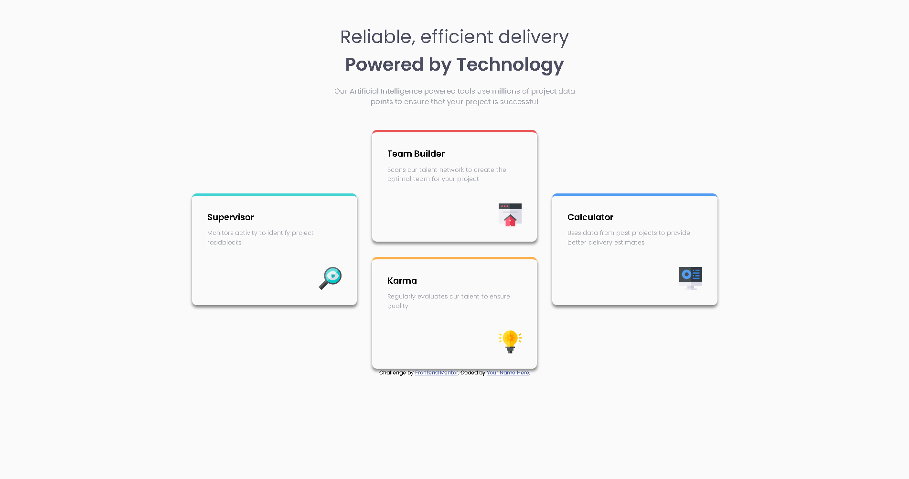

#  Frontend Mentor - Four card feature section

Esta é uma solução para o [# Four card feature section  challenge on Frontend Mentor](https://www.frontendmentor.io/challenges/four-card-feature-section-weK1eFYK). Os desafios do Frontend Mentor ajudam você a melhorar suas habilidades de codificação criando projetos realistas.

##  Índice

- [Visão Geral](#visão-geral)

- [O desafio](#o-desafio)

- [Screenshot](#screenshot)

- [Links](#links)

- [Processo](#processo)

- [Construido com](#construido-com)

- [O que eu aprendi](#o=que-eu-aprendi)

- [Autor](#autor)

##  Visão Geral

###  O desafio

Os usuários devem ser capazes de:

- Visualizar o layout ideal dependendo do tamanho da tela do dispositivo

###  Screenshot

###  Links

- Solution URL: [Add solution URL here](https://github.com/Larvin-Vinicius/four-card-feature-section-praticle)

- Live Site URL: [Add live site URL here](https://3cwgl.csb.app/)

##  Processo

###  Construído com

- Semantic HTML5

- CSS basico

- CSS Grid

###  O que eu aprendi

- Coloquei em pratica o alinhamento de elementos grid

##  Author

- Twitter - [@yourusername](https://twitter.com/Lrv_s)
